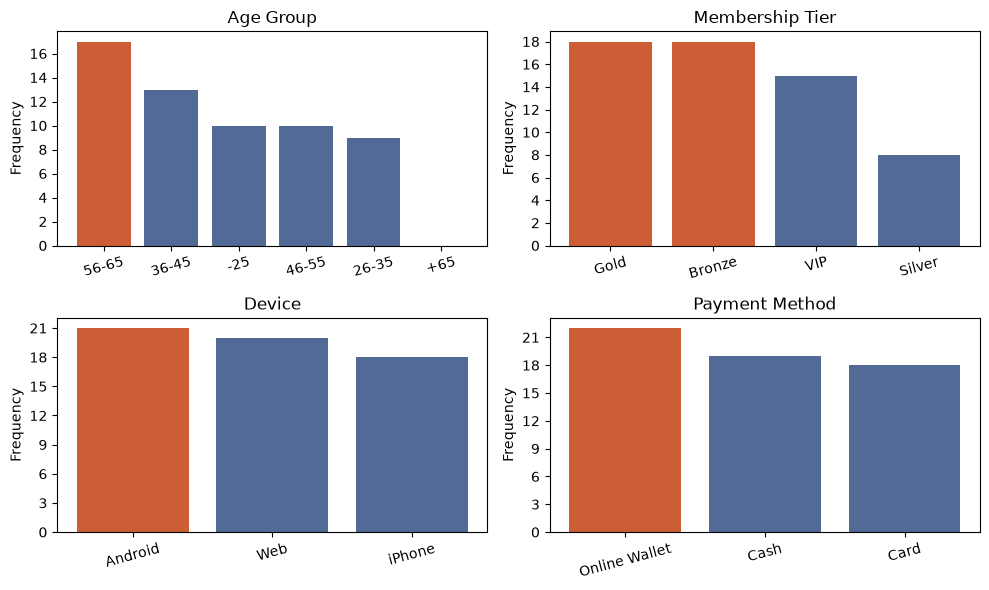
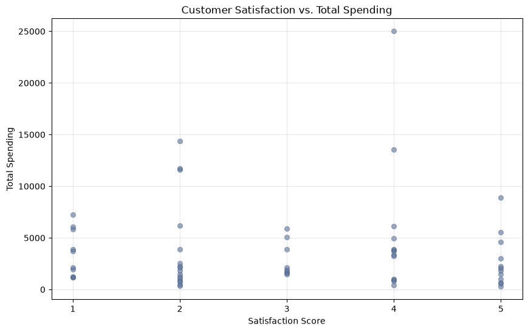
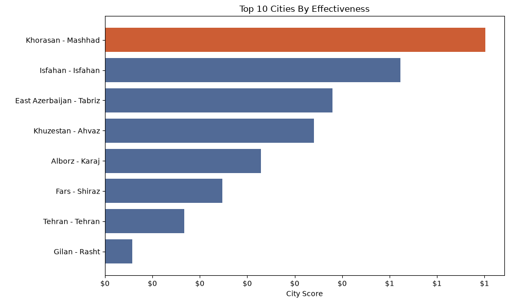
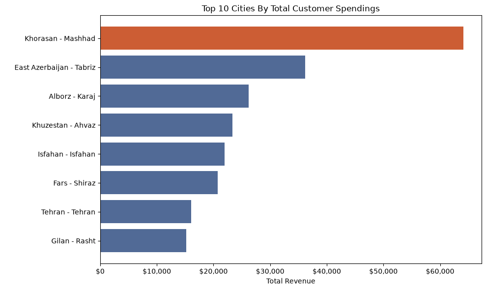
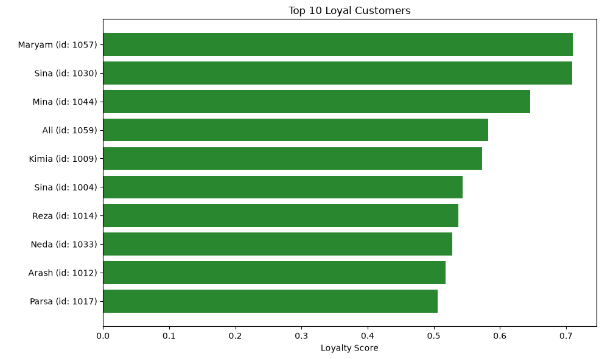
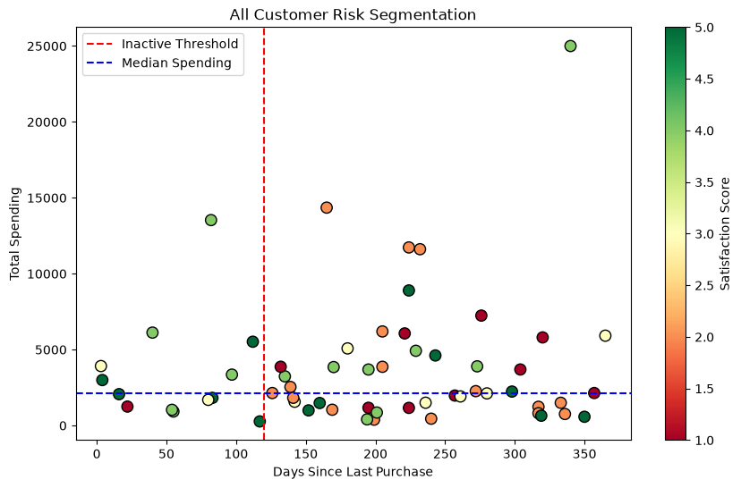
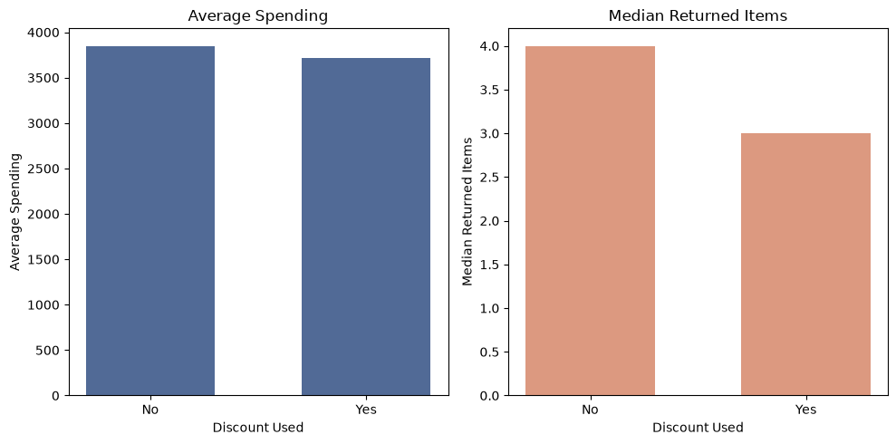
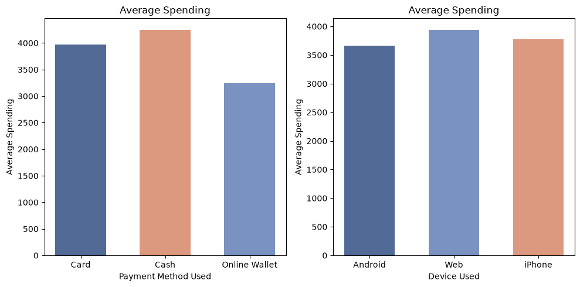

# Project 02 – Customer Analytics and Business Insights

## 📌 Project Overview

This project analyzes customer transaction and demographic data to generate actionable business insights using **Python**, **Pandas**, and **Matplotlib**. The objective is to identify the store's core customers, evaluate regional marketing opportunities, prioritize customers for loyalty and reactivation campaigns, and explore customer behavior across discounts, devices, and payment methods.

The project follows a business-driven analytical workflow where each section answers a practical management question using exploratory data analysis, feature engineering, descriptive statistics, and data visualization.

### Project Structure

| Folder      | Description                                                          |
| ----------- | -------------------------------------------------------------------- |
| `cleaned_dataset.xlsx`     | Cleaned customer dataset                     |
| `customer_analytics_dinaebrahimnadjari.ipynb` | Jupyter notebook containing the complete customer analytics workflow |
| `Executive_Report.pdf`   | Executive report summarizing the business findings                   |
| `charts/`   | charts and visualizations in the notebook                   |
| `README.md` | Project documentation                                                |

---

# Dataset Description

The dataset contains customer-level information describing demographics, purchasing behavior, engagement, and satisfaction.

| Category             | Variables                                                                   |
| -------------------- | --------------------------------------------------------------------------- |
| Customer Information | `customer_id`, `first_name`, `gender`, `age`                                |
| Location             | `city`, `province`                                                          |
| Purchase History     | `purchase_count`, `avg_order_value`, `total_spending`, `last_purchase_days` |
| Customer Profile     | `membership_tier`, `payment_method`, `device`, `discount_used`              |
| Customer Experience  | `returned_items`, `satisfaction_score`                                      |

---

# Data Quality Checks

Dataset used in this analysis was preprocessed and cleaned in this repository [project-01-data-cleaning](https://github.com/StudyBuildCommunity/studybuild-data-cleaning-01/tree/main/submissions/dinanadjari/project-01-data-cleaning)

---

# Business Questions

The analysis answers the following business questions:

1. Who are the store's core customers?
2. Which province and city should receive additional advertising investment?
3. Which customers should be prioritized for the loyalty program?
4. Which valuable customers are at risk of becoming inactive?
5. How are discounts, devices, and payment methods associated with customer behavior?
6. How can these findings be summarized for executive decision-making?

---

# Method and Tools

## Feature Engineering

To support the business analysis, several additional variables were created.

| Feature                | Purpose                                               |
| ---------------------- | ----------------------------------------------------- |
| Age Group              | Segment customers into meaningful age categories      |
| Activity Status        | Categorize customers based on purchase recency        |
| Loyalty Score          | Rank customers for the loyalty program                |
| City Score             | Compare cities using multiple business indicators     |
| Customer Risk Category | Identify valuable customers at risk of inactivity     |

---

## Analytical Techniques

The following analytical methods were applied throughout the project:

* Exploratory Data Analysis (EDA)
* Customer Segmentation
* Descriptive Statistics
* GroupBy Aggregation
* Feature Engineering
* Weighted Scoring Models
* Comparative Analysis
* Business KPI Evaluation
* Data Visualization

---

## Tools and Libraries Used

| Tool             | Purpose                          |
| ---------------- | -------------------------------- |
| Python           | Programming language             |
| Pandas           | Data manipulation and analysis   |
| NumPy            | Numerical operations             |
| Matplotlib       | Data visualization               |
| Jupyter Notebook | Interactive analysis environment |

---

# Key Findings

## Question 1 — Core Customer Profile

* Identified the dominant customer characteristics based on age, membership tier, device, and payment method.
* Compared customer satisfaction by customer's total spendings.

**Chart**

| Characteristic  | Most Common   | Percentage |
| --------------  | --------------|------------|
| age_group       | 56-65         | 28.81 |
| gender          | M             | 57.63 |
| membership_tier | Gold, Bronze  | 30.51 |
| device          | Android       | 35.59 |
| payment_method  | Online Wallet | 37.29 |

---

## Question 2 — Advertising Investment

* Compared cities using customer count, total revenue, average spending, purchase behavior, and customer satisfaction.
* Selected one recommended city and two alternative cities for future advertising investment.

**Chart**

---

## Question 3 — Loyalty Program

* Developed a weighted loyalty score using customer spending, purchase frequency, satisfaction, and purchase recency.
* Ranked the top ten customers for the loyalty program.
* Compared loyalty scores with current membership tiers.

**Chart**

---

## Question 4 — Customer Reactivation

* Defined valuable customers at risk using spending, activity, and satisfaction.
* Identified customers requiring immediate reactivation efforts.
* Proposed different actions for dissatisfied and inactive customer segments.

**Chart**

---

## Question 5 — Customer Behavior

* Compared customer behavior based on discount usage.
* Evaluated differences across devices and payment methods.
* Examined spending, purchase frequency, returns, and satisfaction while avoiding causal conclusions.

**Chart**

---

# Business Recommendations

| Recommendation | Supporting Evidence|
| -------------- | -------------------|
| **Prioritize advertising investment in Mashhad while improving customer satisfaction.** | Mashhad generated the highest total revenue, the highest average customer spending, and achieved the highest overall city score. However, its relatively low satisfaction score suggests that increasing marketing investment should be accompanied by initiatives to improve the customer experience and retention.            |
| **Adopt a behavior-based loyalty program instead of relying on membership tier alone.** | The weighted loyalty score identified several high-value customers whose current membership tier did not fully reflect their purchasing behavior. Incorporating spending, purchase frequency, purchase recency, and satisfaction provides a more objective method for rewarding valuable customers.                             |
| **Launch a targeted reactivation campaign for valuable inactive customers.**            | The analysis identified a group of previously valuable customers with long periods of inactivity. Customers with high satisfaction should receive personalized offers or reminders to encourage repeat purchases, while dissatisfied customers should first receive service recovery initiatives before promotional incentives. |
| **Monitor discount strategies rather than expanding them indiscriminately.**            | Customers who used discounts did not demonstrate higher average spending than non-discount customers, although they reported slightly higher satisfaction. These findings suggest that discounts should be evaluated carefully and not be considered a guaranteed driver of increased revenue.                                  |
| **Use customer value metrics when allocating marketing resources.**                     | Customer count alone did not consistently identify the most valuable segments. Decisions based on average spending, purchase frequency, and customer satisfaction provide a more balanced assessment of long-term business value than relying solely on the size of each customer group.                                        |

---

# Analysis Limitations

* The dataset contains a relatively small number of customers.
* Results represent descriptive analysis and do not establish causal relationships.
* Loyalty score weights were selected based on business assumptions and may vary across organizations.
* Customer behavior was analyzed using historical data only.
* The findings should be used as decision-support insights rather than predictive models.

---

# Files Included

| File                       | Description                           |
| -------------------------- | ------------------------------------- |
| `customer_analytics_dinanadjari.ipynb` | Complete customer analytics notebook  |
| `cleaned_dataset.xlsx`     | Cleaned dataset used for the analysis |
| `README.md`                | Project documentation                 |
| `Executive_Report.docx`    | Five-minute executive report          |

---

# Conclusion

This project demonstrates how exploratory data analysis can be used to support business decision-making. By combining customer demographics, purchasing behavior, satisfaction, and engagement metrics, the analysis identifies valuable customer segments, prioritizes marketing opportunities, supports loyalty and retention strategies, and provides practical recommendations for improving customer relationship management. The resulting insights can help managers allocate resources more effectively while establishing a solid foundation for future predictive analytics.