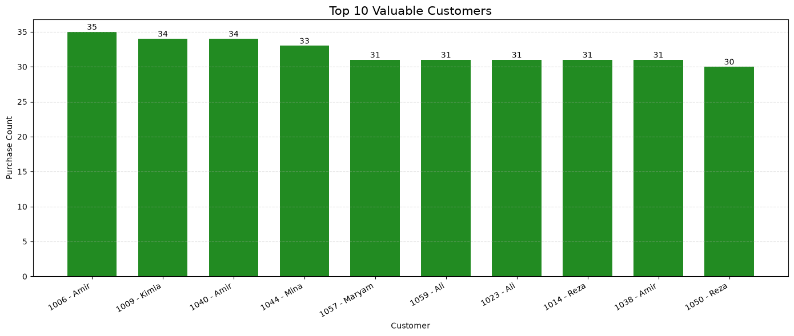
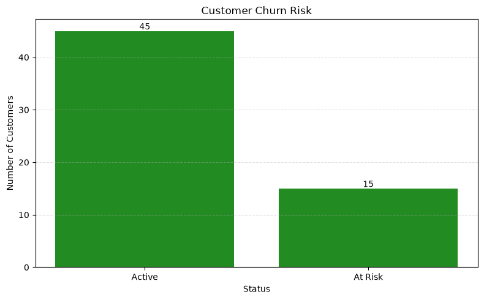
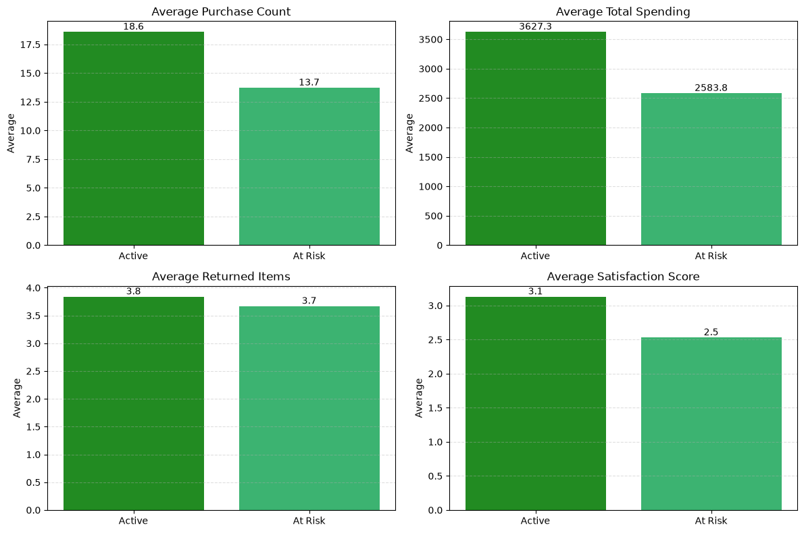
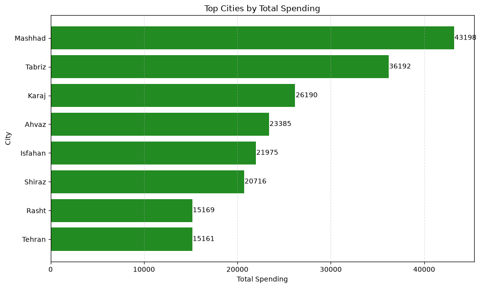
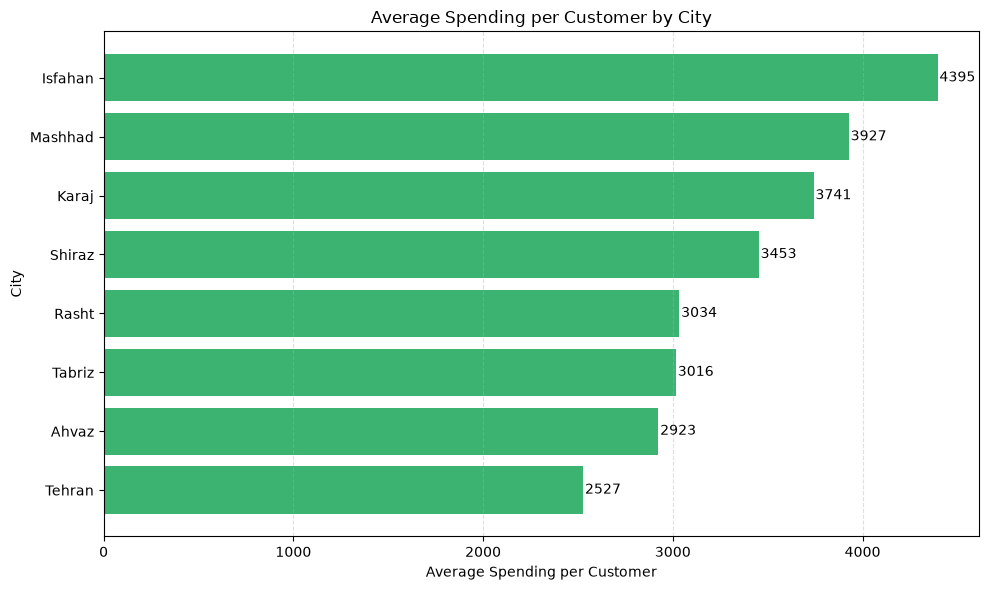
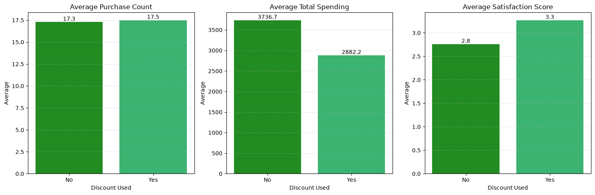

# Customer Behavior Analysis

A business-oriented data analysis project developed with **Python**, **Pandas**, and **Matplotlib**.

This project simulates the role of a **Junior Data Analyst** in an e-commerce company. The objective is to analyze customer data, answer key business questions, and provide actionable recommendations to support management decisions.

---

## Project Overview

The CEO of an online store requested an analysis of customer behavior to answer the following questions:

- Who are the company's most valuable customers?
- Which customers are at risk of churning?
- Which cities are the best targets for marketing campaigns?
- Are discounts actually improving customer behavior?
- What actions can increase future sales?

The analysis focuses on transforming raw customer data into meaningful business insights rather than simply creating charts.

---

## Dataset

The dataset contains customer information, including:

- Customer ID
- Personal Information
- City and Province
- Membership Tier
- Purchase History
- Average Order Value
- Total Spending
- Last Purchase Time
- Returned Items
- Satisfaction Score
- Discount Usage
- Churn Risk

Before starting the analysis, the dataset was validated to ensure data quality.

---

## Project Workflow

The notebook follows a structured data analysis process:

1. Load Dataset
2. Dataset Overview
3. Data Validation
4. Exploratory Data Analysis (EDA)
5. Business Question 1 – Valuable Customers
6. Business Question 2 – Churn Analysis
7. Business Question 3 – Marketing Opportunities
8. Business Question 4 – Discount Effectiveness
9. Business Recommendations
10. Conclusion

---

## Business Questions

### 1. Who are the most valuable customers?

Customers were evaluated primarily using:

* Purchase Count
* Total Spending

<div align="center">
  
</div>

The top customers were identified to support loyalty and retention strategies.

---

### 2. Which customers are at risk of churning?

<div align="center">
  
</div>

Potential churn indicators included:

* Long time since the last purchase
* High number of returned items
* Low satisfaction score

<div align="center">
  
</div>

These customers were identified to help the company take preventive actions before losing them.

---

### 3. Which cities are best for advertising?

<div align="center">
  
</div>

<div align="center">
  
</div>

Cities were compared using:

* Number of unique customers
* Total sales generated

This analysis helps identify regions with strong customer bases and high business potential.

---

### 4. Are discounts effective?

<div align="center">
  
</div>

Customers who used discounts were compared with those who did not based on:

* Average Purchase Count
* Average Total Spending
* Average Satisfaction Score

The goal was to determine whether discount campaigns positively influence customer behavior.

---

## Key Insights

- Customers with higher purchase frequency contribute significantly to total revenue.
- Long periods without purchases combined with lower satisfaction indicate higher churn risk.
- A few cities generate a large portion of the company's customers and revenue, making them strong candidates for marketing investment.
- Customers who used discounts generally showed better purchasing behavior and satisfaction, suggesting that discount campaigns can be effective when used strategically.

---

## Business Recommendations

Based on the analysis, three practical recommendations are proposed:

1. **Strengthen customer loyalty**
   - Reward high-value customers with exclusive offers and loyalty programs.

2. **Reduce customer churn**
   - Identify inactive customers early and launch personalized re-engagement campaigns.

3. **Optimize marketing investment**
   - Focus advertising budgets on cities with larger customer bases while continuing targeted promotions supported by discount strategies.

---

## Technologies Used

- Python
- Pandas
- NumPy
- Matplotlib
- Jupyter Notebook

---

## Skills Demonstrated

- Data Cleaning
- Data Validation
- Exploratory Data Analysis (EDA)
- Customer Segmentation
- Business Analytics
- Data Visualization
- Business Insight Generation

---

## Repository Structure

```text
project-02-data-analysis-nargessabbagh/
│
├── data/
│   └── cleaned_dataset_nargessabbagh.xlsx
│
├── notebook/
│   └── customer_analysis.ipynb
│
├── charts/
│   ├── plot1.png
│   ├── plot2.png
│   ├── plot3.png
│   ├── plot4.png
│   ├── plot5.png
│   └── plot6.png
│
├── report/
│   └── project_report.docx
│
└── README.md
```

---

## Future Improvements

Possible extensions for this project include:

- RFM (Recency, Frequency, Monetary) Analysis
- Customer Lifetime Value (CLV)
- Interactive Dashboard using Plotly or Power BI
- Machine Learning model for churn prediction
- Customer clustering using K-Means

---

## Conclusion

This project demonstrates how customer data can be transformed into actionable business insights using Python and data visualization.

Rather than focusing only on coding, the analysis emphasizes business understanding, customer segmentation, and data-driven decision making.


---

## Author

Developed by **Narges Sabbagh**